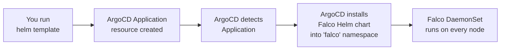
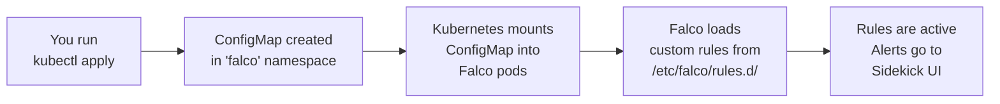
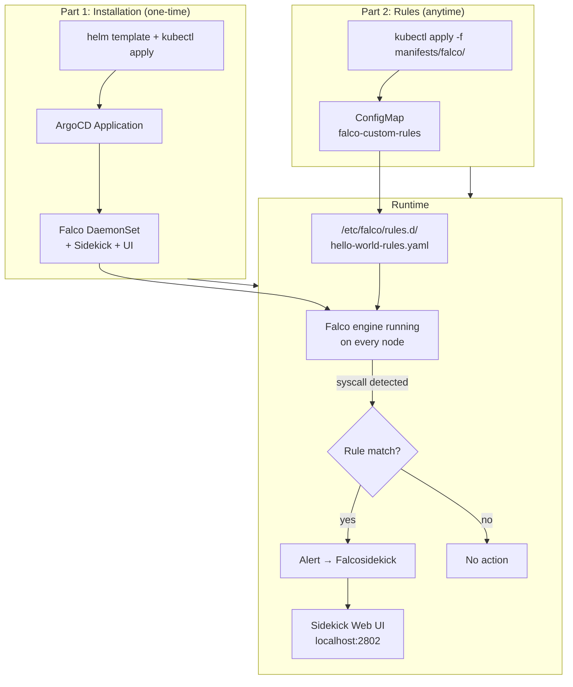
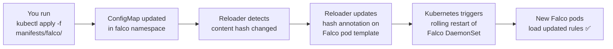

# Falco — From Installation to Custom Rules

This document explains the complete Falco setup: how ArgoCD installs Falco, how custom rules are applied separately, and how the two connect at runtime.

---

## Project Structure

```
manifests/
├── platform_baseline/              ← Falco INSTALLATION (ArgoCD manages)
│   ├── Chart.yaml
│   ├── values.yaml
│   └── templates/
│       └── falco.yaml              ← ArgoCD Application resource
│
└── falco/                          ← Custom RULES (you apply manually)
    └── falco-custom-rules.yaml     ← ConfigMap with rule definitions
```

These two directories are **independent**. You never touch `platform_baseline/` when working with rules, and you never touch `falco/` when changing the installation.

---

## Part 1 — Falco Installation (One-Time, ArgoCD)

### What happens

The `platform_baseline` Helm chart generates an **ArgoCD Application** resource. ArgoCD sees this and installs Falco from the official `falcosecurity/charts` Helm repository.

### Flow



### Step-by-step

```bash
# Generate the ArgoCD Application manifest and apply it
helm template platform-baseline manifests/platform_baseline/ | kubectl apply -f -
```

This creates an ArgoCD `Application` resource in the `argocd` namespace. ArgoCD then:

1. Pulls the Falco Helm chart (`v9.1.0`) from `https://falcosecurity.github.io/charts`
2. Creates the `falco` namespace (`CreateNamespace=true`)
3. Deploys Falco as a **DaemonSet** (runs on every node in the cluster)
4. Deploys **Falcosidekick** + **Web UI** for viewing alerts
5. Enables **auto-sync** — if anything drifts, ArgoCD self-heals

### What gets deployed

| Component | Type | Purpose |
|-----------|------|---------|
| `falco` | DaemonSet | Core runtime security engine on every node |
| `falco-falcosidekick` | Deployment | Receives Falco alerts and routes them |
| `falco-falcosidekick-ui` | Deployment | Web dashboard to view alerts |
| `falco-falcosidekick-ui-redis` | StatefulSet | Stores alert history (1Gi PVC) |

### Key installation config (values.yaml)

| Setting | Value | Why |
|---------|-------|-----|
| `driver.kind` | `modern_ebpf` | Best driver for kernels 5.8+, no init container needed |
| `resources.requests.cpu` | `100m` | Minimum CPU for Falco pods |
| `resources.requests.memory` | `512Mi` | Minimum memory for Falco pods |
| `resources.limits.memory` | `1Gi` | Max memory cap |
| `falco.json_output` | `true` | Structured JSON logs for parsing |
| `falcosidekick.enabled` | `true` | Alert routing + Web UI |

### The mount point (important bridge to rules)

Inside `falco.yaml`, the Helm values include a `mounts` section:

```yaml
mounts:
  volumes:
    - name: falco-custom-rules
      configMap:
        name: falco-custom-rules    # ← looks for this ConfigMap
        optional: true              # ← Falco runs fine without it
  volumeMounts:
    - name: falco-custom-rules
      mountPath: /etc/falco/rules.d # ← mounts into rules directory
```

This tells the Falco DaemonSet:
> "If a ConfigMap named `falco-custom-rules` exists in the `falco` namespace, mount its contents into `/etc/falco/rules.d/`."

- **`optional: true`** means Falco starts and works perfectly even if the ConfigMap doesn't exist yet
- **`/etc/falco/rules.d/`** is where Falco looks for additional rule files beyond its built-in rules
- Each key in the ConfigMap becomes a `.yaml` file inside this directory

**You set this up once. Never touch it again.**

---

## Part 2 — Custom Rules (Apply Anytime, kubectl)

### What happens

You create a Kubernetes **ConfigMap** containing your Falco rules and apply it to the `falco` namespace. The Falco DaemonSet picks it up through the mount configured in Part 1.

### Flow



### Step-by-step

```bash
# Apply the custom rules
kubectl apply -f manifests/falco/
```

That's it. No restart of Falco, no ArgoCD sync, no Helm upgrade.

### The ConfigMap explained

```yaml
apiVersion: v1
kind: ConfigMap
metadata:
  name: falco-custom-rules          # ← must match the name in the mount
  namespace: falco                   # ← must be in the falco namespace
data:
  hello-world-rules.yaml: |-        # ← becomes a file in /etc/falco/rules.d/
    - rule: Unexpected Shell in Hello World Pod
      desc: >
        Detects an interactive shell spawned inside the hello-world pod.
      condition: >
        spawned_process and
        container and
        k8s.pod.name = "hello-world" and
        proc.name in (bash, sh, zsh)
      output: >
        Shell spawned in hello-world pod (user=%user.name command=%proc.cmdline
        pod=%k8s.pod.name container=%container.id image=%container.image.repository)
      priority: WARNING
      tags: [demo, shell, mitre_execution]
```

### How the ConfigMap name connects

```
Installation (falco.yaml)                    Rules (falco-custom-rules.yaml)
─────────────────────────                    ───────────────────────────────
mounts:                                      metadata:
  volumes:                                     name: falco-custom-rules  ◄── same name
    - configMap:                               namespace: falco
        name: falco-custom-rules ──────────►
        optional: true
```

The name `falco-custom-rules` is the **only link** between installation and rules. The installation says "mount it if it exists", the rules ConfigMap provides the content.

### What the rule does

| Field | Value | Meaning |
|-------|-------|---------|
| `condition` | `spawned_process and container and k8s.pod.name = "hello-world" and proc.name in (bash, sh, zsh)` | Triggers when someone opens a shell (bash/sh/zsh) inside the hello-world pod |
| `output` | User, command, pod, container, image info | What gets logged when the rule fires |
| `priority` | `WARNING` | Alert severity level |
| `tags` | `demo, shell, mitre_execution` | Categorization for filtering in Sidekick UI |

---

## Part 3 — End-to-End: How It All Works at Runtime

### Complete flow



### What happens when someone shells into the hello-world pod

1. An operator runs: `kubectl exec -it hello-world -- /bin/sh`
2. Kubernetes creates a shell process inside the container
3. Falco's eBPF probe intercepts the `execve` syscall on the node
4. Falco evaluates the event against all loaded rules (built-in + custom)
5. The `Unexpected Shell in Hello World Pod` rule matches because:
   - `spawned_process` → a new process was created
   - `container` → it happened inside a container
   - `k8s.pod.name = "hello-world"` → it's the hello-world pod
   - `proc.name in (bash, sh, zsh)` → the process is a shell
6. Falco sends the alert to **Falcosidekick**
7. Falcosidekick stores it and displays it in the **Web UI**

---

## Part 4 — Stakater Reloader: Auto-Restart on Rule Changes

### The problem without Reloader

Updating a ConfigMap doesn't restart the pods using it. Kubernetes does update the mounted file inside the container (~60 seconds via kubelet sync), but **Falco reads its rules once at process startup** — it has no file-watcher on `/etc/falco/rules.d/`. So the new YAML sits on disk, correct and updated, but the running Falco process still evaluates the old rule set until something restarts it.

| Step | Automatic? |
|------|-----------|
| `kubectl apply` → ConfigMap updated in cluster | ✅ yes |
| Updated file appears inside pod's mounted volume | ✅ yes (~60s) |
| Falco process re-reads and applies the new rule | ❌ **no** — needs a pod restart |

**Reloader closes this gap.**

### What Reloader does

Reloader is a Kubernetes controller that watches ConfigMaps and Secrets. When it detects a content change, it triggers a rolling restart of any workload (DaemonSet, Deployment, StatefulSet) that uses the changed resource. It does this by updating a hash annotation on the pod template, which Kubernetes treats as a spec change and initiates a rollout.

### How Reloader is installed

Reloader is installed via ArgoCD as part of the platform baseline, just like Falco:

```
manifests/platform_baseline/templates/
├── falco.yaml       ← Falco ArgoCD Application
└── reloader.yaml    ← Reloader ArgoCD Application
```

It runs in the `kube-system` namespace and watches all namespaces.

### Two annotation styles — same result

Reloader supports two ways to declare "what should restart when what changes." Both achieve the same outcome — they just declare the relationship from different sides.

#### Style 1: Workload-side (what we use)

```yaml
# On the Falco DaemonSet (via Helm podAnnotations)
podAnnotations:
  reloader.stakater.com/auto: "true"
```

This tells Reloader: *"Watch every ConfigMap and Secret that this DaemonSet references in its pod spec. If any of them changes, restart me."*

Reloader inspects the pod spec, finds `volumes[].configMap.name: falco-custom-rules`, and watches that exact ConfigMap.

#### Style 2: Source-side (alternative)

```yaml
# On the ConfigMap itself
metadata:
  annotations:
    reloader.stakater.com/match: "true"
```

This tells Reloader: *"I'm a ConfigMap that matters. Find every workload that mounts me and restart them when I change."*

Reloader scans all workloads, checks their `volumes[].configMap.name` and `envFrom[].configMapRef.name` fields, and restarts only the ones that reference this exact ConfigMap by name.

#### Both styles compared

| | Workload-side (`auto`) | Source-side (`match`) |
|---|---|---|
| Annotation on | DaemonSet / Deployment | ConfigMap / Secret |
| Declares | "Restart me if my config changes" | "Restart whoever uses me" |
| Matching logic | Exact name from pod spec volumes/env | Exact name from pod spec volumes/env |
| Our setup | ✅ Used on Falco DaemonSet | Available as alternative |

### Blast radius — why this is safe

Reloader's matching is **always exact name equality** against a specific ConfigMap/Secret object. There is no wildcard, fuzzy match, or label-selector-based fanout.

```
Reloader sees: falco-custom-rules ConfigMap changed
         │
         ▼
Scans all workloads in the namespace
         │
         ▼
Checks each pod spec:
  volumes[].configMap.name == "falco-custom-rules"  ?
  envFrom[].configMapRef.name == "falco-custom-rules"  ?
         │
         ▼
Only restarts workloads with an exact name match
```

**The blast radius is only ever the set of workloads that already, explicitly reference that exact ConfigMap by name in their volume/env config.** This is also exactly the set of workloads that *should* restart — they're the ones consuming stale data otherwise.

For example, if you have:
- `pod-a` mounts `falco-custom-rules` → **restarted** ✅
- `pod-b` mounts `some-other-config` → **not touched** ✅
- `pod-c` mounts nothing → **not touched** ✅

No accidental restarts. No collateral damage.

### The complete auto-reload chain



**Zero manual steps. Just `kubectl apply` and walk away.**

---

## Part 5 — Day-2 Operations

### View alerts in the Web UI

```bash
kubectl port-forward svc/falco-falcosidekick-ui -n falco 2802:2802
```

Open [http://localhost:2802](http://localhost:2802) in your browser.

### Add more rules

Edit `manifests/falco/falco-custom-rules.yaml` and add a new key under `data:`:

```yaml
data:
  hello-world-rules.yaml: |-
    # ... existing rule ...

  network-rules.yaml: |-              # ← new file, new rules
    - rule: Outbound Connection from Hello World
      desc: Detects outbound network connections from hello-world pod
      condition: >
        outbound and
        container and
        k8s.pod.name = "hello-world"
      output: >
        Outbound connection from hello-world (command=%proc.cmdline
        connection=%fd.name pod=%k8s.pod.name)
      priority: NOTICE
      tags: [demo, network]
```

Then apply:

```bash
kubectl apply -f manifests/falco/
```

Reloader auto-restarts Falco. No manual restart needed.

Each key in the ConfigMap becomes a separate file in `/etc/falco/rules.d/`:

```
/etc/falco/rules.d/
├── hello-world-rules.yaml     ← from ConfigMap key
└── network-rules.yaml         ← from ConfigMap key
```

### Update existing rules

Edit the rule in `manifests/falco/falco-custom-rules.yaml`, then:

```bash
kubectl apply -f manifests/falco/
```

Reloader detects the content change and restarts Falco automatically.

### Delete custom rules

```bash
kubectl delete -f manifests/falco/
```

Falco continues running with its built-in rules. The `optional: true` mount means no crash.

### Force restart Falco (if needed)

```bash
kubectl rollout restart daemonset/falco -n falco
```

This should rarely be needed with Reloader in place.

---

## Quick Reference

| Task | Command |
|------|---------|
| Install Falco + Reloader (one-time) | `helm template platform-baseline manifests/platform_baseline/ \| kubectl apply -f -` |
| Apply / update rules | `kubectl apply -f manifests/falco/` |
| Delete rules | `kubectl delete -f manifests/falco/` |
| View alerts (Web UI) | `kubectl port-forward svc/falco-falcosidekick-ui -n falco 2802:2802` |
| Check Falco logs | `kubectl logs -l app.kubernetes.io/name=falco -n falco` |
| Check Reloader logs | `kubectl logs -l app.kubernetes.io/name=reloader -n kube-system` |
| Force restart Falco | `kubectl rollout restart daemonset/falco -n falco` |
| Check ArgoCD sync | `kubectl get application falco reloader -n argocd` |

