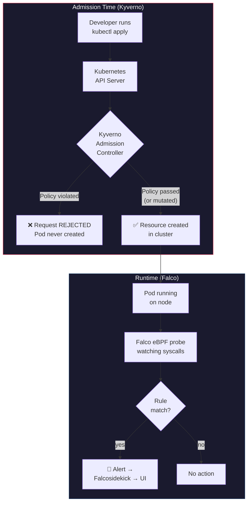

# Kyverno + Falco — Defense in Depth for Kubernetes

> **Who is this for?** Teams running Falco for runtime detection who want to add Kyverno for admission-time prevention. Every example is explained in plain English with deployable YAML.

---

## 1. Why Two Tools?

Kubernetes security has two fundamentally different problems:

| Problem | When it happens | Tool |
|---|---|---|
| **Bad configuration deployed** | At admission time (someone runs `kubectl apply`) | **Kyverno** — blocks it before it runs |
| **Bad behavior at runtime** | After the pod is already running | **Falco** — detects it and alerts |

Neither tool alone covers both. A privileged container can be blocked by Kyverno at admission, but if an attacker exploits a vulnerability inside an *allowed* container and spawns a shell, only Falco can catch that.

> **Analogy:** Kyverno is the bouncer at the door (checks your ID before you enter). Falco is the security camera inside (watches what you do after you're in). You need both.

### What is Kyverno?

Kyverno is a **Kubernetes-native policy engine** that works as an admission controller. When anyone creates, updates, or deletes a Kubernetes resource, the API server sends the request to Kyverno first. Kyverno evaluates the request against your policies and can:

- **Validate** — reject requests that violate policy (e.g., block privileged containers)
- **Mutate** — automatically modify requests to comply (e.g., add security labels)
- **Generate** — create companion resources automatically (e.g., a NetworkPolicy for every new namespace)

Policies are written in **standard YAML** — no special language to learn.

### What is Falco? (Recap)

Falco is a **runtime security engine** that hooks into the Linux kernel via eBPF. It watches every syscall and fires alerts when suspicious activity matches your rules. Covered in detail in the [Falco Conditions Tutorial](../falco-conditions-tutorial.md) and the [Falco Setup Guide](./falco-setup-guide.md).

---

## 2. Architecture — Where Each Tool Sits



**Key insight:** There is a gap between what admission policies can prevent and what actually happens at runtime. Kyverno blocks known-bad configurations. Falco catches unknown-bad behaviors.

---

## 3. Installing Kyverno via ArgoCD

Following the same pattern used for Falco in this project (see [falco.yaml](../manifests/platform_baseline/templates/falco.yaml)), Kyverno is installed as an ArgoCD Application:

```yaml
# manifests/platform_baseline/templates/kyverno.yaml
---
apiVersion: argoproj.io/v1alpha1
kind: Application
metadata:
  name: kyverno
  namespace: argocd
  labels:
    app.kubernetes.io/part-of: platform-baseline
    app.kubernetes.io/component: policy-engine
  finalizers:
    - resources-finalizer.argocd.argoproj.io/background
spec:
  project: default
  source:
    repoURL: https://kyverno.github.io/kyverno/
    chart: kyverno
    targetRevision: "3.3.4"
    helm:
      values: |
        replicaCount: 3
        admissionController:
          replicas: 3
        backgroundController:
          replicas: 2
        cleanupController:
          replicas: 2
        reportsController:
          replicas: 2
  destination:
    server: https://kubernetes.default.svc
    namespace: kyverno
  syncPolicy:
    automated:
      prune: true
      selfHeal: true
    syncOptions:
      - CreateNamespace=true
      - ServerSideApply=true
```

**Apply it the same way as Falco:**
```bash
helm template platform-baseline manifests/platform_baseline/ | kubectl apply -f -
```

ArgoCD handles the rest — installs Kyverno, creates the namespace, and keeps it synced.

> **Why `ServerSideApply=true`?** Kyverno creates webhook configurations that can conflict with ArgoCD's default client-side apply. Server-side apply handles these metadata fields cleanly.

---

## 4. The Defense-in-Depth Map

This table maps every security concern to its prevention policy (Kyverno) and detection rule (Falco). Some threats can only be prevented, some can only be detected, and the best ones have both layers.

| # | Security Concern | Kyverno (Prevention) | Falco (Detection) | Coverage |
|---|---|---|---|---|
| 1 | Privileged containers | Block `privileged: true` | Detect privileged container started | Both |
| 2 | Host namespaces | Block `hostPID/hostNetwork/hostIPC` | Detect host namespace usage | Both |
| 3 | Root user in container | Require `runAsNonRoot: true` | Detect process as root in container | Both |
| 4 | Untrusted image registry | Restrict to approved registries | Detect container from unknown registry | Both |
| 5 | Floating image tags | Block `:latest` tag | Detect container running `:latest` | Both |
| 6 | No resource limits | Require CPU/memory limits | Detect resource exhaustion behavior | Both |
| 7 | Writable root filesystem | Require `readOnlyRootFilesystem` | Detect write to container root fs | Both |
| 8 | Dangerous capabilities | Drop `ALL` capabilities | Detect capability usage at runtime | Both |
| 9 | Privilege escalation | Block `allowPrivilegeEscalation` | Detect setuid/setgid execution | Both |
| 10 | HostPath mounts | Block hostPath volumes | Detect sensitive host path access | Both |
| 11 | Service account tokens | Block automount on default SA | Detect SA token file access | Both |
| 12 | NodePort exposure | Block NodePort services | Detect unexpected listening port | Both |
| 13 | Missing health probes | Require liveness/readiness probes | Detect CrashLoopBackOff pattern | Both |
| 14 | Missing labels | Require `app.kubernetes.io/name` | — | Prevention only |
| 15 | Network segmentation | Generate default-deny NetworkPolicy | Detect unexpected outbound connection | Both |
| 16 | Image pull policy | Mutate to `Always` for `:latest` | — | Prevention only |
| 17 | PSS namespace labels | Add PSS labels to namespaces | — | Prevention only |
| 18 | Shell in container | — | Detect interactive shell spawned | Detection only |
| 19 | Crypto mining | — | Detect mining process/connection | Detection only |
| 20 | Sensitive file access | — | Detect `/etc/shadow`, key file reads | Detection only |
| 21 | Log tampering | — | Detect log file deletion | Detection only |
| 22 | Symlink attacks | — | Detect symlink-based path traversal | Detection only |
| 23 | Reverse shell | — | Detect reverse shell connection | Detection only |

---

## 5. The Examples — Kyverno + Falco Side by Side

Each example shows the Kyverno policy that **prevents** a misconfiguration and the Falco rule that **detects** the same threat at runtime. For runtime-only threats (no admission-time equivalent), only the Falco rule is shown.

All policies and rules below are also available as deployable manifests:
- Kyverno: [`manifests/kyverno/kyverno-policies.yaml`](../manifests/kyverno/kyverno-policies.yaml)
- Falco: [`manifests/falco/falco-kyverno-companion-rules.yaml`](../manifests/falco/falco-kyverno-companion-rules.yaml)

---

### Example 1 — Disallow Privileged Containers

**Why it matters:** A privileged container has full access to the host kernel — it can load kernel modules, access all devices, and escape containment entirely. This is the single most dangerous container configuration.

#### Kyverno Policy (Prevention)

```yaml
apiVersion: policies.kyverno.io/v1
kind: ValidatingPolicy
metadata:
  name: disallow-privileged-containers
  annotations:
    policies.kyverno.io/title: Disallow Privileged Containers
    policies.kyverno.io/category: Pod Security Standards (Baseline)
    policies.kyverno.io/severity: high
    policies.kyverno.io/description: >-
      Privileged containers have full access to the host. This policy
      ensures that the privileged flag is never set to true.
  labels:
    app.kubernetes.io/part-of: kyverno-falco-policies
spec:
  validationActions:
    - Deny
  matchConstraints:
    resourceRules:
      - apiGroups: [""]
        apiVersions: ["v1"]
        operations: [CREATE, UPDATE]
        resources: [pods]
  validations:
    - message: "Privileged containers are not allowed."
      expression: >-
        !object.spec.containers.exists(c, has(c.securityContext) && has(c.securityContext.privileged) && c.securityContext.privileged == true) &&
        !object.spec.?initContainers.orValue([]).exists(c, has(c.securityContext) && has(c.securityContext.privileged) && c.securityContext.privileged == true) &&
        !object.spec.?ephemeralContainers.orValue([]).exists(c, has(c.securityContext) && has(c.securityContext.privileged) && c.securityContext.privileged == true)
```

**What this does:** Rejects any Pod that sets `privileged: true` on *any* container — regular, init, or ephemeral. The `=(...)` syntax means "if this field exists, validate it" — it won't fail just because there are no initContainers.

#### Falco Rule (Detection)

```yaml
- rule: Privileged Container Started
  desc: >
    Detects a container that was started with privileged mode.
    This should never happen if Kyverno is enforcing, so this alert
    means either Kyverno was bypassed or is in Audit mode.
  condition: >
    container_started and container and container.privileged = true
  output: >
    Privileged container started (user=%user.name pod=%k8s.pod.name
    ns=%k8s.ns.name image=%container.image.repository)
  priority: CRITICAL
  tags: [kyverno_companion, privileged, mitre_privilege_escalation]
```

**Defense in depth:** If Kyverno is in `Enforce` mode, this Falco rule should *never* fire. If it does, it means something bypassed admission control (e.g., a controller creating pods directly, or Kyverno was down).

---

### Example 2 — Disallow Host Namespaces

**Why it matters:** `hostPID`, `hostIPC`, and `hostNetwork` break container isolation. A container with `hostPID` can see and signal *all* processes on the node. `hostNetwork` bypasses network policies entirely.

#### Kyverno Policy (Prevention)

```yaml
apiVersion: policies.kyverno.io/v1
kind: ValidatingPolicy
metadata:
  name: disallow-host-namespaces
  annotations:
    policies.kyverno.io/title: Disallow Host Namespaces
    policies.kyverno.io/category: Pod Security Standards (Baseline)
    policies.kyverno.io/severity: high
    policies.kyverno.io/description: >-
      Containers must not share the host PID, IPC, or network namespaces.
  labels:
    app.kubernetes.io/part-of: kyverno-falco-policies
spec:
  validationActions:
    - Deny
  matchConstraints:
    resourceRules:
      - apiGroups: [""]
        apiVersions: ["v1"]
        operations: [CREATE, UPDATE]
        resources: [pods]
  validations:
    - message: "Host PID, IPC, and network namespaces are not allowed."
      expression: >-
        !(has(object.spec.hostPID) && object.spec.hostPID == true) &&
        !(has(object.spec.hostIPC) && object.spec.hostIPC == true) &&
        !(has(object.spec.hostNetwork) && object.spec.hostNetwork == true)
```

#### Falco Rule (Detection)

```yaml
- rule: Container Using Host Namespace
  desc: >
    Detects a container running with host PID or network namespace.
  condition: >
    container_started and container
    and (container.privileged = true or k8s.pod.name != "")
    and (evt.arg.flags contains "CLONE_NEWPID" or evt.arg.flags contains "CLONE_NEWNET")
  output: >
    Container uses host namespace (pod=%k8s.pod.name ns=%k8s.ns.name
    image=%container.image.repository)
  priority: CRITICAL
  tags: [kyverno_companion, host_namespace, mitre_privilege_escalation]
```

---

### Example 3 — Require Non-Root User

**Why it matters:** Running as root inside a container means any container escape gives root on the host. Running as non-root limits the blast radius of a compromise.

#### Kyverno Policy (Prevention)

```yaml
apiVersion: policies.kyverno.io/v1
kind: ValidatingPolicy
metadata:
  name: require-run-as-non-root
  annotations:
    policies.kyverno.io/title: Require runAsNonRoot
    policies.kyverno.io/category: Pod Security Standards (Restricted)
    policies.kyverno.io/severity: medium
    policies.kyverno.io/description: >-
      Containers must set runAsNonRoot to true to prevent running as UID 0.
  labels:
    app.kubernetes.io/part-of: kyverno-falco-policies
spec:
  validationActions:
    - Deny
  matchConstraints:
    resourceRules:
      - apiGroups: [""]
        apiVersions: ["v1"]
        operations: [CREATE, UPDATE]
        resources: [pods]
  validations:
    - message: "Containers must not run as root. Set securityContext.runAsNonRoot to true."
      expression: >-
        (has(object.spec.securityContext) && has(object.spec.securityContext.runAsNonRoot) && object.spec.securityContext.runAsNonRoot == true) ||
        object.spec.containers.all(c, has(c.securityContext) && has(c.securityContext.runAsNonRoot) && c.securityContext.runAsNonRoot == true)
```

#### Falco Rule (Detection)

```yaml
- rule: Container Running as Root User
  desc: >
    Detects a process running as root (UID 0) inside a container.
  condition: >
    spawned_process and container
    and user.uid = 0
    and not k8s.ns.name in (kube-system, kyverno)
  output: >
    Process running as root in container (user=%user.name uid=%user.uid
    command=%proc.cmdline pod=%k8s.pod.name ns=%k8s.ns.name)
  priority: WARNING
  tags: [kyverno_companion, root_user, mitre_privilege_escalation]
```

---

### Example 4 — Restrict Image Registries

**Why it matters:** Pulling images from untrusted registries is a supply chain attack vector. An attacker could publish a malicious image with the same name as a legitimate one on Docker Hub.

#### Kyverno Policy (Prevention)

```yaml
apiVersion: policies.kyverno.io/v1
kind: ValidatingPolicy
metadata:
  name: restrict-image-registries
  annotations:
    policies.kyverno.io/title: Restrict Image Registries
    policies.kyverno.io/category: Supply Chain Security
    policies.kyverno.io/severity: high
    policies.kyverno.io/description: >-
      Images may only be pulled from approved registries.
  labels:
    app.kubernetes.io/part-of: kyverno-falco-policies
spec:
  validationActions:
    - Deny
  matchConstraints:
    resourceRules:
      - apiGroups: [""]
        apiVersions: ["v1"]
        operations: [CREATE, UPDATE]
        resources: [pods]
  validations:
    - message: "Images must come from an approved registry (ECR, ghcr.io, gcr.io, or registry.k8s.io)."
      expression: >-
        object.spec.containers.all(c,
          c.image.contains('.dkr.ecr.') ||
          c.image.startsWith('ghcr.io/') ||
          c.image.startsWith('gcr.io/') ||
          c.image.startsWith('registry.k8s.io/') ||
          c.image.startsWith('docker.io/') ||
          !c.image.contains('/')
        )
```

#### Falco Rule (Detection)

```yaml
- list: approved_registries
  items:
    - dkr.ecr
    - ghcr.io
    - gcr.io
    - registry.k8s.io

- rule: Container from Untrusted Registry
  desc: >
    Detects a running container whose image was pulled from a registry
    not in the approved list.
  condition: >
    container_started and container
    and not container.image.repository contains "dkr.ecr"
    and not container.image.repository contains "ghcr.io"
    and not container.image.repository contains "gcr.io"
    and not container.image.repository contains "registry.k8s.io"
  output: >
    Container from untrusted registry (image=%container.image.repository:%container.image.tag
    pod=%k8s.pod.name ns=%k8s.ns.name)
  priority: ERROR
  tags: [kyverno_companion, supply_chain, mitre_initial_access]
```

---

### Example 5 — Disallow Latest Tag

**Why it matters:** The `:latest` tag is mutable — it points to different images over time. You can't reproduce a deployment, audit what's running, or guarantee the image hasn't been replaced with something malicious.

#### Kyverno Policy (Prevention)

```yaml
apiVersion: policies.kyverno.io/v1
kind: ValidatingPolicy
metadata:
  name: disallow-latest-tag
  annotations:
    policies.kyverno.io/title: Disallow Latest Tag
    policies.kyverno.io/category: Supply Chain Security
    policies.kyverno.io/severity: medium
    policies.kyverno.io/description: >-
      Using the :latest tag makes deployments non-reproducible. Require
      explicit version tags.
  labels:
    app.kubernetes.io/part-of: kyverno-falco-policies
spec:
  validationActions:
    - Deny
  matchConstraints:
    resourceRules:
      - apiGroups: [""]
        apiVersions: ["v1"]
        operations: [CREATE, UPDATE]
        resources: [pods]
  validations:
    - message: "An image tag is required and must not be ':latest'."
      expression: >-
        object.spec.containers.all(c, !c.image.endsWith(':latest')) &&
        object.spec.?initContainers.orValue([]).all(c, !c.image.endsWith(':latest'))
```

**What the pattern `"!*:latest & *:*"` means:**
- `*:*` — must have a tag (the `:` separator must exist)
- `!*:latest` — the tag must NOT be `latest`

#### Falco Rule (Detection)

```yaml
- rule: Container Running with Latest Tag
  desc: >
    Detects a running container using the :latest image tag.
  condition: >
    container_started and container
    and (container.image.tag = "latest" or container.image.tag = "")
  output: >
    Container running with :latest tag (image=%container.image.repository:%container.image.tag
    pod=%k8s.pod.name ns=%k8s.ns.name)
  priority: NOTICE
  tags: [kyverno_companion, latest_tag, supply_chain]
```

---

### Example 6 — Require Resource Limits

**Why it matters:** A container without resource limits can consume all CPU and memory on a node, causing a denial-of-service for every other workload on that node.

#### Kyverno Policy (Prevention)

```yaml
apiVersion: policies.kyverno.io/v1
kind: ValidatingPolicy
metadata:
  name: require-resource-limits
  annotations:
    policies.kyverno.io/title: Require Resource Limits
    policies.kyverno.io/category: Best Practices
    policies.kyverno.io/severity: medium
    policies.kyverno.io/description: >-
      All containers must define CPU and memory limits to prevent resource
      exhaustion on shared nodes.
  labels:
    app.kubernetes.io/part-of: kyverno-falco-policies
spec:
  validationActions:
    - Deny
  matchConstraints:
    resourceRules:
      - apiGroups: [""]
        apiVersions: ["v1"]
        operations: [CREATE, UPDATE]
        resources: [pods]
  validations:
    - message: "CPU and memory limits are required for all containers."
      expression: >-
        object.spec.containers.all(c,
          has(c.resources) &&
          has(c.resources.limits) &&
          has(c.resources.limits.cpu) &&
          has(c.resources.limits.memory)
        )
```

**What `"?*"` means:** "Any non-empty value" — at least one character is required. This ensures the field exists and has a value, without constraining *what* the value is.

#### Falco Rule (Detection)

```yaml
- rule: Container Resource Exhaustion Behavior
  desc: >
    Detects a container process consuming excessive resources, potentially
    indicating a fork bomb or resource exhaustion attack.
  condition: >
    spawned_process and container
    and proc.name in (stress, stress-ng, yes, dd)
    and not k8s.ns.name in (kube-system)
  output: >
    Resource exhaustion tool detected (command=%proc.cmdline pod=%k8s.pod.name
    ns=%k8s.ns.name image=%container.image.repository)
  priority: WARNING
  tags: [kyverno_companion, resource_abuse, mitre_impact]
```

---

### Example 7 — Require Read-Only Root Filesystem

**Why it matters:** A writable root filesystem lets attackers drop binaries, modify configs, or install backdoors inside the container. Making it read-only forces all writes to explicitly mounted volumes.

#### Kyverno Policy (Prevention)

```yaml
apiVersion: policies.kyverno.io/v1
kind: ValidatingPolicy
metadata:
  name: require-readonly-rootfs
  annotations:
    policies.kyverno.io/title: Require Read-Only Root Filesystem
    policies.kyverno.io/category: Pod Security Standards (Restricted)
    policies.kyverno.io/severity: medium
    policies.kyverno.io/description: >-
      Containers must use a read-only root filesystem. Any writable
      paths should be explicitly defined as volume mounts.
  labels:
    app.kubernetes.io/part-of: kyverno-falco-policies
spec:
  validationActions:
    - Audit
  matchConstraints:
    resourceRules:
      - apiGroups: [""]
        apiVersions: ["v1"]
        operations: [CREATE, UPDATE]
        resources: [pods]
  validations:
    - message: "Root filesystem must be read-only. Set securityContext.readOnlyRootFilesystem to true."
      expression: >-
        object.spec.containers.all(c,
          has(c.securityContext) &&
          has(c.securityContext.readOnlyRootFilesystem) &&
          c.securityContext.readOnlyRootFilesystem == true
        )
```

> **Note:** This starts in `Audit` mode because many applications write to temp directories. Migrate to `Enforce` after adding `emptyDir` volumes for `/tmp` in your deployments.

#### Falco Rule (Detection)

```yaml
- rule: Write to Container Root Filesystem
  desc: >
    Detects file writes to the container root filesystem, excluding
    known-safe paths like /tmp and /proc.
  condition: >
    evt.type in (open, openat, openat2) and evt.dir = <
    and container
    and evt.is_open_write = true
    and not fd.name startswith "/tmp"
    and not fd.name startswith "/proc"
    and not fd.name startswith "/dev"
    and not fd.name startswith "/sys"
    and fd.name != ""
    and not k8s.ns.name in (kube-system, kyverno)
  output: >
    File written to container root fs (file=%fd.name command=%proc.cmdline
    pod=%k8s.pod.name ns=%k8s.ns.name)
  priority: WARNING
  tags: [kyverno_companion, rootfs_write, mitre_persistence]
```

---

### Example 8 — Drop All Capabilities

**Why it matters:** Linux capabilities grant specific superuser powers. By default, containers get a dangerous set. Best practice is to drop ALL and add back only what's needed.

#### Kyverno Policy (Prevention)

```yaml
apiVersion: policies.kyverno.io/v1
kind: ValidatingPolicy
metadata:
  name: drop-all-capabilities
  annotations:
    policies.kyverno.io/title: Drop All Capabilities
    policies.kyverno.io/category: Pod Security Standards (Restricted)
    policies.kyverno.io/severity: medium
    policies.kyverno.io/description: >-
      Containers must drop ALL Linux capabilities. Only explicitly needed
      capabilities should be added back.
  labels:
    app.kubernetes.io/part-of: kyverno-falco-policies
spec:
  validationActions:
    - Deny
  matchConstraints:
    resourceRules:
      - apiGroups: [""]
        apiVersions: ["v1"]
        operations: [CREATE, UPDATE]
        resources: [pods]
  validations:
    - message: "Containers must drop ALL capabilities."
      expression: >-
        object.spec.containers.all(c,
          has(c.securityContext) &&
          has(c.securityContext.capabilities) &&
          has(c.securityContext.capabilities.drop) &&
          c.securityContext.capabilities.drop.exists(x, x == 'ALL')
        )
```

#### Falco Rule (Detection)

```yaml
- rule: Dangerous Capability Used at Runtime
  desc: >
    Detects a process attempting to use dangerous Linux capabilities
    such as SYS_ADMIN, SYS_PTRACE, or NET_RAW.
  condition: >
    spawned_process and container
    and (proc.name = "nsenter" or proc.name = "unshare"
      or proc.cmdline contains "capsh"
      or proc.cmdline contains "--cap-add")
  output: >
    Dangerous capability usage detected (command=%proc.cmdline user=%user.name
    pod=%k8s.pod.name ns=%k8s.ns.name)
  priority: WARNING
  tags: [kyverno_companion, capabilities, mitre_privilege_escalation]
```

---

### Example 9 — Disallow Privilege Escalation

**Why it matters:** `allowPrivilegeEscalation: true` allows a process to gain more privileges than its parent via setuid/setgid binaries. This is the mechanism behind `sudo`, `su`, and many container escape techniques.

#### Kyverno Policy (Prevention)

```yaml
apiVersion: policies.kyverno.io/v1
kind: ValidatingPolicy
metadata:
  name: disallow-privilege-escalation
  annotations:
    policies.kyverno.io/title: Disallow Privilege Escalation
    policies.kyverno.io/category: Pod Security Standards (Restricted)
    policies.kyverno.io/severity: high
    policies.kyverno.io/description: >-
      Containers must not allow privilege escalation via setuid/setgid binaries.
  labels:
    app.kubernetes.io/part-of: kyverno-falco-policies
spec:
  validationActions:
    - Deny
  matchConstraints:
    resourceRules:
      - apiGroups: [""]
        apiVersions: ["v1"]
        operations: [CREATE, UPDATE]
        resources: [pods]
  validations:
    - message: "Privilege escalation is not allowed. Set allowPrivilegeEscalation to false."
      expression: >-
        object.spec.containers.all(c,
          has(c.securityContext) &&
          has(c.securityContext.allowPrivilegeEscalation) &&
          c.securityContext.allowPrivilegeEscalation == false
        ) &&
        object.spec.?initContainers.orValue([]).all(c,
          has(c.securityContext) &&
          has(c.securityContext.allowPrivilegeEscalation) &&
          c.securityContext.allowPrivilegeEscalation == false
        )
```

#### Falco Rule (Detection)

```yaml
- rule: Setuid or Setgid Binary Executed in Container
  desc: >
    Detects execution of setuid/setgid binaries inside a container,
    which can be used for privilege escalation.
  condition: >
    spawned_process and container
    and (proc.name in (sudo, su, newgrp, chsh, chfn, passwd)
      or proc.name = "pkexec")
    and not k8s.ns.name in (kube-system)
  output: >
    Setuid/setgid binary executed (command=%proc.cmdline user=%user.name
    pod=%k8s.pod.name ns=%k8s.ns.name image=%container.image.repository)
  priority: ERROR
  tags: [kyverno_companion, privilege_escalation, mitre_privilege_escalation]
```

---

### Example 10 — Disallow HostPath Volumes

**Why it matters:** HostPath mounts give a container direct access to the node's filesystem. An attacker can read SSH keys, Docker sockets, or even overwrite system binaries.

#### Kyverno Policy (Prevention)

```yaml
apiVersion: policies.kyverno.io/v1
kind: ValidatingPolicy
metadata:
  name: disallow-hostpath-volumes
  annotations:
    policies.kyverno.io/title: Disallow HostPath Volumes
    policies.kyverno.io/category: Pod Security Standards (Baseline)
    policies.kyverno.io/severity: high
    policies.kyverno.io/description: >-
      HostPath volumes give containers direct access to the node filesystem.
      This policy blocks all hostPath volume mounts.
  labels:
    app.kubernetes.io/part-of: kyverno-falco-policies
spec:
  validationActions:
    - Deny
  matchConstraints:
    resourceRules:
      - apiGroups: [""]
        apiVersions: ["v1"]
        operations: [CREATE, UPDATE]
        resources: [pods]
  validations:
    - message: "HostPath volumes are not allowed."
      expression: >-
        !has(object.spec.volumes) || !object.spec.volumes.exists(v, has(v.hostPath))
```

**What `X(hostPath): "null"` means:** The `X()` operator (Kyverno's "must not exist" check) ensures the `hostPath` field is absent from every volume definition.

#### Falco Rule (Detection)

```yaml
- list: sensitive_host_paths
  items:
    - /etc/shadow
    - /etc/kubernetes
    - /var/run/docker.sock
    - /var/run/containerd
    - /root/.ssh
    - /root/.kube
    - /home

- rule: Sensitive Host Path Accessed from Container
  desc: >
    Detects a container accessing sensitive paths on the host filesystem
    via a hostPath mount.
  condition: >
    evt.type in (open, openat, openat2) and evt.dir = <
    and container
    and (fd.name startswith "/etc/shadow"
      or fd.name startswith "/etc/kubernetes"
      or fd.name startswith "/var/run/docker.sock"
      or fd.name startswith "/root/.ssh"
      or fd.name startswith "/root/.kube")
  output: >
    Sensitive host path accessed from container (file=%fd.name command=%proc.cmdline
    pod=%k8s.pod.name ns=%k8s.ns.name)
  priority: CRITICAL
  tags: [kyverno_companion, hostpath, mitre_credential_access]
```

---

### Example 11 — Block Default Service Account Token

**Why it matters:** Every pod gets a mounted service account token by default. If compromised, that token can be used to query the Kubernetes API. Most pods don't need it.

#### Kyverno Policy (Prevention)

```yaml
apiVersion: policies.kyverno.io/v1
kind: ValidatingPolicy
metadata:
  name: disallow-default-sa-token
  annotations:
    policies.kyverno.io/title: Disallow Default Service Account Token
    policies.kyverno.io/category: Security Best Practices
    policies.kyverno.io/severity: medium
    policies.kyverno.io/description: >-
      Pods using the default service account must not automount the
      service account token unless explicitly needed.
  labels:
    app.kubernetes.io/part-of: kyverno-falco-policies
spec:
  validationActions:
    - Audit
  matchConstraints:
    resourceRules:
      - apiGroups: [""]
        apiVersions: ["v1"]
        operations: [CREATE, UPDATE]
        resources: [pods]
  validations:
    - message: "Pods using the default service account must set automountServiceAccountToken to false."
      expression: >-
        (!has(object.spec.serviceAccountName) || object.spec.serviceAccountName == 'default') ?
        (has(object.spec.automountServiceAccountToken) && object.spec.automountServiceAccountToken == false) : true
```

#### Falco Rule (Detection)

```yaml
- rule: Service Account Token Accessed in Container
  desc: >
    Detects a container process reading the Kubernetes service account
    token file, which could indicate credential harvesting.
  condition: >
    evt.type in (open, openat, openat2) and evt.dir = <
    and container
    and fd.name contains "/var/run/secrets/kubernetes.io/serviceaccount"
    and not k8s.ns.name in (kube-system, kyverno)
    and not proc.name in (pause, tini)
  output: >
    Service account token accessed (file=%fd.name command=%proc.cmdline
    pod=%k8s.pod.name ns=%k8s.ns.name user=%user.name)
  priority: WARNING
  tags: [kyverno_companion, sa_token, mitre_credential_access]
```

#### Test Scenarios & CEL Logic Trace

##### Scenario 1 — Default ServiceAccount (Condition = `true`, Check Evaluated)

* **❌ FAILS — Implicit default SA without token opt-out (`test-default-sa-fail`):**
  ```yaml
  apiVersion: v1
  kind: Pod
  metadata:
    name: test-default-sa-fail
    namespace: default
  spec:
    containers:
      - name: app
        image: nginx:latest
  ```
  * **Trace:** `!has(serviceAccountName)` → `true` → condition true → true-branch: `has(automountServiceAccountToken)` → `false` → overall result: `false` (Violation).

* **✅ PASSES — Implicit default SA with token opt-out (`test-default-sa-pass`):**
  ```yaml
  apiVersion: v1
  kind: Pod
  metadata:
    name: test-default-sa-pass
    namespace: default
  spec:
    automountServiceAccountToken: false
    containers:
      - name: app
        image: nginx:latest
  ```
  * **Trace:** Condition true (implicit default) → true-branch: `has(automountServiceAccountToken)` → `true`, `automountServiceAccountToken == false` → `true` → overall result: `true` (Compliant).

##### Scenario 2 — Custom ServiceAccount (Condition = `false`, Policy Skips Check)

* **✅ PASSES — Custom SA (`test-custom-sa`):**
  ```yaml
  apiVersion: v1
  kind: ServiceAccount
  metadata:
    name: my-app-sa
    namespace: default
  ---
  apiVersion: v1
  kind: Pod
  metadata:
    name: test-custom-sa
    namespace: default
  spec:
    serviceAccountName: my-app-sa
    containers:
      - name: app
        image: nginx:latest
  ```
  * **Trace:** `!has(serviceAccountName)` → `false`; `serviceAccountName == 'default'` → `false`. Condition `false || false` → `false` → ternary takes `: true` branch immediately → overall result: `true` (Always passes, regardless of `automountServiceAccountToken`).

---

### Example 12 — Disallow NodePort Services

**Why it matters:** NodePort services expose a port on *every* node in the cluster, bypassing ingress controllers and load balancers. This creates an uncontrolled attack surface.

#### Kyverno Policy (Prevention)

```yaml
apiVersion: policies.kyverno.io/v1
kind: ValidatingPolicy
metadata:
  name: disallow-nodeport-services
  annotations:
    policies.kyverno.io/title: Disallow NodePort Services
    policies.kyverno.io/category: Network Security
    policies.kyverno.io/severity: medium
    policies.kyverno.io/description: >-
      NodePort services expose ports on every cluster node. Use LoadBalancer
      or Ingress instead for controlled external access.
  labels:
    app.kubernetes.io/part-of: kyverno-falco-policies
spec:
  validationActions:
    - Deny
  matchConstraints:
    resourceRules:
      - apiGroups: [""]
        apiVersions: ["v1"]
        operations: [CREATE, UPDATE]
        resources: [services]
  validations:
    - message: "NodePort services are not allowed. Use LoadBalancer or ClusterIP."
      expression: >-
        !has(object.spec.type) || object.spec.type != 'NodePort'
```

#### Falco Rule (Detection)

```yaml
- rule: Unexpected Listening Port in Container
  desc: >
    Detects a container process binding to a port outside the expected
    application range (common for backdoors and reverse shells).
  condition: >
    evt.type in (bind, listen) and evt.dir = <
    and container
    and fd.sport != 0
    and not fd.sport in (80, 443, 8080, 8443, 3000, 5000, 9090)
    and not k8s.ns.name in (kube-system, kyverno)
  output: >
    Unexpected port binding in container (port=%fd.sport command=%proc.cmdline
    pod=%k8s.pod.name ns=%k8s.ns.name)
  priority: NOTICE
  tags: [kyverno_companion, network, mitre_command_and_control]
```

---

### Example 13 — Require Health Probes

**Why it matters:** Without liveness and readiness probes, Kubernetes can't detect unhealthy containers. A container that's hung, deadlocked, or compromised will keep receiving traffic.

#### Kyverno Policy (Prevention)

```yaml
apiVersion: policies.kyverno.io/v1
kind: ValidatingPolicy
metadata:
  name: require-pod-probes
  annotations:
    policies.kyverno.io/title: Require Pod Probes
    policies.kyverno.io/category: Best Practices
    policies.kyverno.io/severity: medium
    policies.kyverno.io/description: >-
      All containers must define liveness and readiness probes to ensure
      Kubernetes can detect and recover from unhealthy states.
  labels:
    app.kubernetes.io/part-of: kyverno-falco-policies
spec:
  validationActions:
    - Audit
  matchConstraints:
    resourceRules:
      - apiGroups: [""]
        apiVersions: ["v1"]
        operations: [CREATE, UPDATE]
        resources: [pods]
  validations:
    - message: "Liveness and readiness probes are required for all containers."
      expression: >-
        object.spec.containers.all(c, has(c.livenessProbe) && has(c.readinessProbe))
```

#### Falco Rule (Detection)

```yaml
- rule: Container Process Crash Loop Detected
  desc: >
    Detects repeated process crashes in a container, which may indicate
    an unhealthy application that is bypassing health probe checks.
  condition: >
    spawned_process and container
    and proc.name in (sh, bash)
    and proc.cmdline contains "exit"
    and proc.duration <= 5000000000
  output: >
    Rapid process restart detected — possible crash loop (command=%proc.cmdline
    pod=%k8s.pod.name ns=%k8s.ns.name)
  priority: NOTICE
  tags: [kyverno_companion, health, reliability]
```

---

### Example 14 — Require Standard Labels (Mutation)

**Why it matters:** Consistent labeling enables filtering, monitoring, and cost allocation. Without labels, you can't answer "who owns this pod?" or "which team's pods are consuming the most resources?"

#### Kyverno Policy (Prevention — Validate)

```yaml
apiVersion: policies.kyverno.io/v1
kind: ValidatingPolicy
metadata:
  name: require-labels
  annotations:
    policies.kyverno.io/title: Require Standard Labels
    policies.kyverno.io/category: Best Practices
    policies.kyverno.io/severity: low
    policies.kyverno.io/description: >-
      All Pods must have the app.kubernetes.io/name label.
  labels:
    app.kubernetes.io/part-of: kyverno-falco-policies
spec:
  validationActions:
    - Audit
  matchConstraints:
    resourceRules:
      - apiGroups: [""]
        apiVersions: ["v1"]
        operations: [CREATE, UPDATE]
        resources: [pods]
  validations:
    - message: "The label 'app.kubernetes.io/name' is required."
      expression: >-
        has(object.metadata.labels) && 'app.kubernetes.io/name' in object.metadata.labels && object.metadata.labels['app.kubernetes.io/name'] != ''
```

> **No Falco companion** — labels are a metadata concern. There's no runtime syscall that corresponds to "missing labels." This is a prevention-only control.

---

### Example 15 — Generate Default-Deny Network Policy

**Why it matters:** Without a NetworkPolicy, all pods can communicate with all other pods (and the internet). A default-deny policy ensures zero-trust networking — traffic is blocked unless explicitly allowed.

#### Kyverno Policy (Generation)

```yaml
apiVersion: policies.kyverno.io/v1
kind: GeneratingPolicy
metadata:
  name: generate-default-deny-netpol
  annotations:
    policies.kyverno.io/title: Generate Default-Deny Network Policy
    policies.kyverno.io/category: Network Security
    policies.kyverno.io/severity: high
    policies.kyverno.io/description: >-
      Automatically creates a default-deny NetworkPolicy in every new
      namespace to enforce zero-trust networking.
  labels:
    app.kubernetes.io/part-of: kyverno-falco-policies
spec:
  matchConstraints:
    resourceRules:
      - apiGroups: ['']
        apiVersions: ['v1']
        operations: [CREATE]
        resources: [namespaces]
  variables:
    - name: nsName
      expression: 'object.metadata.name'
    - name: downstream
      expression: >-
        [
          {
            "apiVersion": dyn("networking.k8s.io/v1"),
            "kind": dyn("NetworkPolicy"),
            "metadata": dyn({
              "name": "default-deny-all",
              "namespace": string(variables.nsName)
            }),
            "spec": dyn({
              "podSelector": dyn({}),
              "policyTypes": dyn(["Ingress", "Egress"])
            })
          }
        ]
  generate:
    - expression: generator.Apply(variables.nsName, variables.downstream)
```

**What `synchronize: true` means:** If you update the Kyverno policy, the generated NetworkPolicy in every namespace also updates. If someone deletes the generated NetworkPolicy, Kyverno recreates it.

#### Falco Rule (Detection)

```yaml
- rule: Unexpected Outbound Connection from Container
  desc: >
    Detects outbound network connections to destinations outside the
    cluster's internal network ranges.
  condition: >
    evt.type = connect and evt.dir = <
    and container
    and fd.typechar = 4
    and fd.ip != "0.0.0.0"
    and not fd.sip in ("10.0.0.0/8", "172.16.0.0/12", "192.168.0.0/16")
    and not k8s.ns.name in (kube-system, kyverno)
  output: >
    Unexpected outbound connection (connection=%fd.name command=%proc.cmdline
    pod=%k8s.pod.name ns=%k8s.ns.name)
  priority: WARNING
  tags: [kyverno_companion, network, mitre_exfiltration]
```

---

### Example 16 — Mutate Image Pull Policy

**Why it matters:** If someone accidentally deploys `:latest` with `imagePullPolicy: IfNotPresent`, Kubernetes may use a cached (potentially stale or compromised) image. This mutation ensures `:latest` always pulls fresh.

#### Kyverno Policy (Mutation)

```yaml
apiVersion: policies.kyverno.io/v1
kind: MutatingPolicy
metadata:
  name: mutate-image-pull-policy
  annotations:
    policies.kyverno.io/title: Set Image Pull Policy to Always for Latest
    policies.kyverno.io/category: Supply Chain Security
    policies.kyverno.io/severity: low
    policies.kyverno.io/description: >-
      Automatically sets imagePullPolicy to Always for containers using
      the :latest tag.
  labels:
    app.kubernetes.io/part-of: kyverno-falco-policies
spec:
  matchConstraints:
    resourceRules:
      - apiGroups: [""]
        apiVersions: ["v1"]
        operations: [CREATE, UPDATE]
        resources: [pods]
  mutations:
    - patchType: ApplyConfiguration
      applyConfiguration:
        expression: >-
          Object{
            spec: Object.spec{
              containers: object.spec.containers.map(c,
                c.image.endsWith(':latest') || !c.image.contains(':') ?
                  Object.spec.containers{
                    name: c.name,
                    imagePullPolicy: 'Always'
                  } :
                  Object.spec.containers{
                    name: c.name
                  }
              )
            }
          }
```

**What `(image): "*:latest"` means:** The parentheses make `image` an anchor — "find containers where image matches `*:latest`, and apply this patch to those containers." It's a conditional mutation.

> **No Falco companion** — this is a mutation-only policy. The `:latest` detection is already covered by Example 5.

---

### Example 17 — Add PSS Labels to Namespaces

**Why it matters:** Kubernetes Pod Security Admission (PSA) uses namespace labels to enforce Pod Security Standards. This policy ensures every namespace gets the `baseline` security level by default.

#### Kyverno Policy (Mutation)

```yaml
apiVersion: policies.kyverno.io/v1
kind: MutatingPolicy
metadata:
  name: add-pss-labels
  annotations:
    policies.kyverno.io/title: Add Pod Security Standards Labels
    policies.kyverno.io/category: Pod Security Standards
    policies.kyverno.io/severity: medium
    policies.kyverno.io/description: >-
      Automatically adds Pod Security Standard labels to new namespaces
      to enforce baseline security at the namespace level.
  labels:
    app.kubernetes.io/part-of: kyverno-falco-policies
spec:
  matchConstraints:
    resourceRules:
      - apiGroups: [""]
        apiVersions: ["v1"]
        operations: [CREATE]
        resources: [namespaces]
  mutations:
    - patchType: ApplyConfiguration
      applyConfiguration:
        expression: >-
          Object{
            metadata: Object.metadata{
              labels: {
                "pod-security.kubernetes.io/enforce": "baseline",
                "pod-security.kubernetes.io/enforce-version": "latest",
                "pod-security.kubernetes.io/warn": "restricted",
                "pod-security.kubernetes.io/warn-version": "latest"
              }
            }
          }
```

> **No Falco companion** — PSS labels are namespace metadata. Runtime enforcement of the actual security controls is handled by Examples 1–9.

---

### Example 18 — Detect Shell in Container (Runtime Only)

**Why it matters:** An interactive shell inside a production container is a strong indicator of either debugging by an operator (risky) or an attacker who has gained initial access. No admission policy can prevent this — the container itself is legitimate, only the *behavior* is suspicious.

> **No Kyverno companion** — Kyverno operates at admission time. It cannot prevent `kubectl exec` sessions or shells spawned by application vulnerabilities.

#### Falco Rule (Detection)

```yaml
- rule: Interactive Shell Spawned in Container
  desc: >
    Detects an interactive shell (bash, sh, zsh) spawned inside a
    container. This is a common post-exploitation indicator.
  condition: >
    spawned_process and container
    and proc.name in (bash, sh, zsh, ksh, csh, fish, dash)
    and proc.tty != 0
    and not k8s.ns.name in (kube-system, kyverno)
  output: >
    Interactive shell spawned in container (user=%user.name shell=%proc.name
    command=%proc.cmdline pod=%k8s.pod.name ns=%k8s.ns.name
    image=%container.image.repository)
  priority: WARNING
  tags: [runtime_only, shell, mitre_execution]
```

---

### Example 19 — Detect Crypto Mining (Runtime Only)

**Why it matters:** Cryptojacking is one of the most common Kubernetes attacks. Attackers exploit exposed APIs or vulnerable applications to run miners inside containers, consuming your cloud compute bill.

> **No Kyverno companion** — the containers are legitimate; the malicious processes are launched *inside* them after deployment.

#### Falco Rule (Detection)

```yaml
- list: crypto_mining_processes
  items: [xmrig, minerd, minergate, cpuminer, ethminer, cgminer, bfgminer, nbminer, t-rex, gminer, lolminer]

- list: crypto_mining_pools
  items: [pool.minergate.com, xmr.pool.minergate.com, monerohash.com, minexmr.com, nanopool.org, hashvault.pro, supportxmr.com, gulf.moneroocean.stream]

- rule: Crypto Mining Process Detected
  desc: >
    Detects known cryptocurrency mining processes or connections to
    known mining pool domains.
  condition: >
    spawned_process and container
    and (proc.name in (crypto_mining_processes)
      or proc.cmdline contains "stratum+tcp://"
      or proc.cmdline contains "stratum+ssl://"
      or proc.cmdline icontains "cryptonight"
      or proc.cmdline icontains "randomx")
  output: >
    Crypto mining detected (command=%proc.cmdline pod=%k8s.pod.name
    ns=%k8s.ns.name image=%container.image.repository user=%user.name)
  priority: CRITICAL
  tags: [runtime_only, crypto_mining, mitre_resource_hijacking]
```

---

### Example 20 — Detect Sensitive File Access (Runtime Only)

**Why it matters:** Reading `/etc/shadow`, private keys, or Kubernetes config files from inside a container is a classic credential harvesting technique. These files should never be accessed by application processes.

> **No Kyverno companion** — file access happens at runtime, not at admission time.

#### Falco Rule (Detection)

```yaml
- list: sensitive_file_paths
  items:
    - /etc/shadow
    - /etc/gshadow
    - /etc/master.passwd

- rule: Sensitive File Read in Container
  desc: >
    Detects access to sensitive credential files from inside a container.
  condition: >
    evt.type in (open, openat, openat2) and evt.dir = <
    and container
    and evt.is_open_read = true
    and (fd.name in (/etc/shadow, /etc/gshadow, /etc/master.passwd)
      or fd.name endswith ".pem"
      or fd.name endswith ".key"
      or fd.name endswith ".p12"
      or fd.name endswith ".pfx"
      or fd.name contains "id_rsa"
      or fd.name contains "id_ed25519")
    and not proc.name in (sshd, ssh-agent)
  output: >
    Sensitive file read in container (file=%fd.name command=%proc.cmdline
    pod=%k8s.pod.name ns=%k8s.ns.name user=%user.name)
  priority: ERROR
  tags: [runtime_only, credential_access, mitre_credential_access]
```

---

### Example 21 — Detect Log Tampering (Runtime Only)

**Why it matters:** Attackers commonly delete or truncate log files to cover their tracks after a breach. If `/var/log/` files are being deleted inside a container, someone is hiding evidence.

> **No Kyverno companion** — log file deletion is a runtime behavior.

#### Falco Rule (Detection)

```yaml
- rule: Log File Deletion in Container
  desc: >
    Detects deletion of log files inside a container, which may indicate
    an attacker covering their tracks.
  condition: >
    evt.type in (unlink, unlinkat, rename, renameat) and evt.dir = <
    and container
    and (fd.name startswith "/var/log/"
      or fd.name endswith ".log"
      or fd.name contains "syslog"
      or fd.name contains "auth.log"
      or fd.name contains "history")
    and not proc.name in (logrotate, journald)
  output: >
    Log file deleted in container (file=%fd.name command=%proc.cmdline
    pod=%k8s.pod.name ns=%k8s.ns.name user=%user.name)
  priority: ERROR
  tags: [runtime_only, log_tampering, mitre_defense_evasion]
```

---

### Example 22 — Detect Symlink Attacks (Runtime Only)

**Why it matters:** Symlink attacks (CVE-2021-25741 and similar) let containers escape their filesystem boundaries by creating symbolic links that point to host paths. This is a container escape vector.

> **No Kyverno companion** — symlink creation is a runtime operation.

#### Falco Rule (Detection)

```yaml
- rule: Symlink Created to Sensitive Path
  desc: >
    Detects creation of symbolic links pointing to sensitive paths,
    which is a common container escape technique (CVE-2021-25741).
  condition: >
    evt.type in (symlink, symlinkat) and evt.dir = <
    and container
    and (evt.arg.target startswith "/etc/"
      or evt.arg.target startswith "/proc/"
      or evt.arg.target startswith "/sys/"
      or evt.arg.target startswith "/var/run/")
  output: >
    Symlink to sensitive path created (target=%evt.arg.target link=%fd.name
    command=%proc.cmdline pod=%k8s.pod.name ns=%k8s.ns.name)
  priority: CRITICAL
  tags: [runtime_only, symlink_attack, mitre_privilege_escalation]
```

---

### Example 23 — Detect Reverse Shell (Runtime Only)

**Why it matters:** A reverse shell is the classic "phone home" technique. The attacker gets the compromised container to initiate a connection back to their server, giving them interactive access. This is the most dangerous post-exploitation step.

> **No Kyverno companion** — reverse shells are runtime behaviors, not deployment configurations.

#### Falco Rule (Detection)

```yaml
- rule: Reverse Shell Detected in Container
  desc: >
    Detects processes commonly used to establish reverse shells, including
    netcat, bash redirections, and scripting language one-liners.
  condition: >
    spawned_process and container
    and (proc.name in (nc, ncat, netcat, nmap, socat)
      or (proc.name = "bash" and proc.cmdline contains "/dev/tcp/")
      or (proc.name = "python" and proc.cmdline contains "socket")
      or (proc.name = "python3" and proc.cmdline contains "socket")
      or (proc.name = "perl" and proc.cmdline contains "socket")
      or (proc.name = "ruby" and proc.cmdline contains "TCPSocket")
      or (proc.name = "php" and proc.cmdline contains "fsockopen"))
  output: >
    Possible reverse shell detected (command=%proc.cmdline pod=%k8s.pod.name
    ns=%k8s.ns.name image=%container.image.repository user=%user.name)
  priority: CRITICAL
  tags: [runtime_only, reverse_shell, mitre_command_and_control]
```

---

## 6. Applying the Policies

### Kyverno Policies

All 17 Kyverno policies are packaged in a single deployable manifest:

```bash
# Apply all Kyverno ClusterPolicies
kubectl apply -f manifests/kyverno/kyverno-policies.yaml
```

Verify they're active:
```bash
kubectl get clusterpolicies
```

Expected output:
```
NAME                                ADMISSION   BACKGROUND   VALIDATE ACTION   READY   AGE
disallow-privileged-containers      true        true         Enforce           True    10s
disallow-host-namespaces            true        true         Enforce           True    10s
require-run-as-non-root             true        true         Enforce           True    10s
restrict-image-registries           true        true         Enforce           True    10s
...
```

### Falco Rules

The companion Falco rules are a ConfigMap that extends the existing custom rules:

```bash
# Apply companion Falco rules
kubectl apply -f manifests/falco/falco-kyverno-companion-rules.yaml
```

Reloader auto-restarts Falco to pick up the new rules (see [Falco Setup Guide](./falco-setup-guide.md#part-4--stakater-reloader-auto-restart-on-rule-changes)).

### Test a policy

Try creating a privileged pod — Kyverno should block it:

```bash
# This should be REJECTED by Kyverno
kubectl run test-priv --image=nginx --restart=Never \
  --overrides='{"spec":{"containers":[{"name":"test-priv","image":"nginx","securityContext":{"privileged":true}}]}}'
```

Expected error:
```
Error from server: admission webhook "validate.kyverno.svc-fail" denied the request:
resource Pod/default/test-priv was blocked due to the following policies:
disallow-privileged-containers:
  deny-privileged: Privileged containers are not allowed.
```

---

## 7. Audit vs. Enforce — Rollout Strategy

> **Golden rule:** Start in Audit mode. Observe. Fix false positives. Then switch to Enforce.

### Recommended rollout phases

| Phase | Duration | `validationFailureAction` | What happens |
|---|---|---|---|
| **1. Audit** | 1–2 weeks | `Audit` | Policies log violations but don't block anything. Check `PolicyReport` resources. |
| **2. Warn** | 1 week | `Audit` + warnings | Same as audit, but users see warning messages on `kubectl apply`. |
| **3. Enforce** | Ongoing | `Enforce` | Violations are blocked. Non-compliant resources cannot be created. |

### Check audit results

```bash
# View policy violations across the cluster
kubectl get policyreport -A

# Get detailed report for a specific namespace
kubectl get policyreport -n default -o yaml
```

### Policies that should start in Audit mode

Some policies need tuning before enforcement:

| Policy | Start in | Why |
|---|---|---|
| `require-readonly-rootfs` | Audit | Many apps write to `/tmp` — need to add `emptyDir` volumes first |
| `require-pod-probes` | Audit | Some system pods (jobs, CronJobs) don't need probes |
| `require-labels` | Audit | Existing deployments may not have standard labels yet |
| `disallow-default-sa-token` | Audit | Some apps legitimately need the SA token |

### Policies safe to enforce immediately

| Policy | Why safe |
|---|---|
| `disallow-privileged-containers` | There's almost never a legitimate need |
| `disallow-host-namespaces` | Same — very rarely needed |
| `disallow-privilege-escalation` | Most applications don't need this |
| `disallow-latest-tag` | Easy for developers to fix — just add a tag |
| `disallow-nodeport-services` | Use Ingress/LoadBalancer instead |
| `disallow-hostpath-volumes` | Use PVCs instead |

---

## 8. Quick Reference

### All 30 examples at a glance

| # | Policy Name | Type | Kind | Kyverno | Falco |
|---|---|---|---|---|---|
| 1 | Privileged Containers | Validate | ValidatingPolicy | ✅ | ✅ |
| 2 | Host Namespaces | Validate | ValidatingPolicy | ✅ | ✅ |
| 3 | Non-Root User | Validate | ValidatingPolicy | ✅ | ✅ |
| 4 | Image Registries | Validate | ValidatingPolicy | ✅ | ✅ |
| 5 | Latest Tag | Validate | ValidatingPolicy | ✅ | ✅ |
| 6 | Resource Limits | Validate | ValidatingPolicy | ✅ | ✅ |
| 7 | Read-Only Root FS | Validate | ValidatingPolicy | ✅ | ✅ |
| 8 | Drop Capabilities | Validate | ValidatingPolicy | ✅ | ✅ |
| 9 | Privilege Escalation | Validate | ValidatingPolicy | ✅ | ✅ |
| 10 | HostPath Volumes | Validate | ValidatingPolicy | ✅ | ✅ |
| 11 | SA Token Mount | Validate | ValidatingPolicy | ✅ | ✅ |
| 12 | NodePort Services | Validate | ValidatingPolicy | ✅ | ✅ |
| 13 | Health Probes | Validate | ValidatingPolicy | ✅ | ✅ |
| 14 | Standard Labels | Validate | ValidatingPolicy | ✅ | — |
| 15 | Network Policy | Generate | GeneratingPolicy | ✅ | ✅ |
| 16 | Image Pull Policy | Mutate | MutatingPolicy | ✅ | — |
| 17 | PSS Labels | Mutate | MutatingPolicy | ✅ | — |
| 18 | Shell in Container | — | — | — | ✅ |
| 19 | Crypto Mining | — | — | — | ✅ |
| 20 | Sensitive File Access | — | — | — | ✅ |
| 21 | Log Tampering | — | — | — | ✅ |
| 22 | Symlink Attacks | — | — | — | ✅ |
| 23 | Reverse Shell | — | — | — | ✅ |
| 24 | Inject Default Resources | Mutate | MutatingPolicy | ✅ | ✅ |
| 25 | Cleanup Completed Jobs | Delete | **DeletingPolicy** | ✅ | — |
| 26 | Cleanup Failed Pods | Delete | **DeletingPolicy** | ✅ | — |
| 27 | Verify Image Signatures | Image Validate | **ImageValidatingPolicy** | ✅ | — |
| 28 | Clone Registry Secret | Generate | GeneratingPolicy | ✅ | — |
| 29 | Require HA Replicas | Validate | ValidatingPolicy | ✅ | — |
| 30 | Inject Sidecar Proxy | Mutate | MutatingPolicy | ✅ | — |


### Quick commands

| Task | Command |
|---|---|
| Apply Kyverno policies | `kubectl apply -f manifests/kyverno/kyverno-policies.yaml` |
| Apply Falco companion rules | `kubectl apply -f manifests/falco/falco-kyverno-companion-rules.yaml` |
| View Kyverno policy reports | `kubectl get policyreport -A` |
| View Falco alerts | `kubectl port-forward svc/falco-falcosidekick-ui -n falco 2802:2802` |
| Check Kyverno policy status | `kubectl get clusterpolicies` |
| Test a policy (dry run) | `kubectl apply -f test-pod.yaml --dry-run=server` |
| View Kyverno logs | `kubectl logs -l app.kubernetes.io/component=admission-controller -n kyverno` |


---

## 9. Mastering MutatingPolicy & GitOps Integration (ArgoCD & Flux)

> **Official Kyverno Reference:** [Kyverno MutatingPolicy GitOps Considerations](https://kyverno.io/docs/policy-types/mutating-policy/#gitops-considerations)

### The GitOps Mutation Conflict Problem

When running GitOps tools like **ArgoCD** or **Flux**, the controller continuously compares live cluster objects against target manifests stored in Git.

If a Kyverno **`MutatingPolicy`** mutates incoming objects at admission time (e.g. injecting default resource requests, adding security labels, or setting `imagePullPolicy: Always`), the live state in Kubernetes will contain fields that **do not exist in your Git repository**.

```
┌────────────────────────┐      GitOps Sync      ┌────────────────────────┐
│ Git Manifest (No limits)├─────────────────────►│  Live Cluster Object   │
└────────────────────────┘                      └───────────┬────────────┘
                                                            │ Mutated at admission
                                                            ▼
                                                ┌────────────────────────┐
                                                │ Kyverno MutatingPolicy │
                                                │ (Injected 100m CPU)    │
                                                └───────────┬────────────┘
                                                            │
                                  ArgoCD Drift Detected    │
                                ◄──────────────────────────┘
                                Status: OutOfSync / Reverting
```

Without proper GitOps configurations:
1. ArgoCD marks the application status as **`OutOfSync`**.
2. If Auto-Sync / Self-Healing is enabled, ArgoCD attempts to revert the mutated fields to match Git.
3. Kyverno re-mutates the pod on subsequent updates, creating an infinite **reconciliation loop**.

---

### Solution 1: Configure ArgoCD `ignoreDifferences`

Tell ArgoCD to ignore specific paths populated dynamically by Kyverno:

```yaml
apiVersion: argoproj.io/v1alpha1
kind: Application
metadata:
  name: platform-workloads
  namespace: argocd
spec:
  ignoreDifferences:
    # Ignore resource requests mutated by Kyverno
    - group: ""
      kind: Pod
      jsonPointers:
        - /spec/containers/0/resources/requests
    # Ignore PSS labels added to Namespaces
    - group: ""
      kind: Namespace
      jsonPointers:
        - /metadata/labels/pod-security.kubernetes.io~1enforce
        - /metadata/labels/pod-security.kubernetes.io~1warn
```

---

### Solution 2: Enable `RespectIgnoreDifferences=true`

In ArgoCD v2.6+, enable `RespectIgnoreDifferences=true` in `syncOptions` to prevent automated self-healing from overriding fields specified in `ignoreDifferences`:

```yaml
spec:
  syncPolicy:
    automated:
      prune: true
      selfHeal: true
    syncOptions:
      - RespectIgnoreDifferences=true
```

---

### Real-Time Example: Inject Default Resource Requests (`Inject_Default_Resources`)

**Why it matters:** Ensures every container gets baseline CPU (`100m`) and memory (`128Mi`) requests to protect node capacity, while allowing developers to omit verbose resource blocks in developer manifests.

#### Kyverno MutatingPolicy (`policies.kyverno.io/v1` CEL)

```yaml
apiVersion: policies.kyverno.io/v1
kind: MutatingPolicy
metadata:
  name: inject-default-resources
  annotations:
    policies.kyverno.io/title: Inject Default Resource Requests
    policies.kyverno.io/category: Resource Management
    policies.kyverno.io/severity: medium
    policies.kyverno.io/description: >-
      Automatically mutates pod specs to inject baseline CPU (100m) and memory
      (128Mi) requests for containers that omit resource requests.
  labels:
    app.kubernetes.io/part-of: kyverno-falco-policies
spec:
  matchConstraints:
    resourceRules:
      - apiGroups: [""]
        apiVersions: ["v1"]
        operations: [CREATE, UPDATE]
        resources: [pods]
  mutations:
    - patchType: ApplyConfiguration
      applyConfiguration:
        expression: >-
          Object{
            spec: Object.spec{
              containers: object.spec.containers.map(c,
                !has(c.resources) || !has(c.resources.requests) ?
                  Object.spec.containers{
                    name: c.name,
                    resources: Object.spec.containers.resources{
                      requests: {
                        "cpu": "100m",
                        "memory": "128Mi"
                      }
                    }
                  } :
                  Object.spec.containers{
                    name: c.name
                  }
              )
            }
          }
```

---

### Example 25 — Cleanup Completed Jobs (DeletingPolicy)

**Why it matters:** Completed Jobs accumulate over time, consuming etcd storage and cluttering namespace listings. This policy automatically removes them on a cron schedule.

> **New Policy Type: `DeletingPolicy`** — Not an admission webhook. Runs as a cron-scheduled background job managed by the Kyverno cleanup controller.

#### Kyverno Policy (Deletion)

```yaml
apiVersion: policies.kyverno.io/v1
kind: DeletingPolicy
metadata:
  name: cleanup-completed-jobs
  annotations:
    policies.kyverno.io/title: Cleanup Completed Jobs
    policies.kyverno.io/category: Cluster Hygiene
    policies.kyverno.io/severity: low
    policies.kyverno.io/description: >-
      Automatically deletes completed Kubernetes Jobs daily at 2 AM UTC
      to prevent stale resources from accumulating in the cluster.
  labels:
    app.kubernetes.io/part-of: kyverno-falco-policies
spec:
  schedule: '0 2 * * *'
  matchConstraints:
    resourceRules:
      - apiGroups: ['batch']
        apiVersions: ['v1']
        resources: ['jobs']
  conditions:
    - name: is-completed
      expression: >-
        object.status.conditions.exists(c,
          c.type == 'Complete' && c.status == 'True')
```

**Key concepts:**
- `schedule: '0 2 * * *'` — Standard cron expression (daily at 2 AM UTC).
- `conditions` — CEL expressions evaluated per resource. All must return `true` for deletion.
- `.exists(c, ...)` — CEL list macro: `true` if at least one element matches.

---

### Example 26 — Cleanup Failed Pods (DeletingPolicy)

**Why it matters:** Pods in `Failed` phase (OOMKilled, evicted, ImagePullBackOff) remain indefinitely unless manually deleted.

#### Kyverno Policy (Deletion)

```yaml
apiVersion: policies.kyverno.io/v1
kind: DeletingPolicy
metadata:
  name: cleanup-failed-pods
  annotations:
    policies.kyverno.io/title: Cleanup Failed Pods
    policies.kyverno.io/category: Cluster Hygiene
    policies.kyverno.io/severity: low
    policies.kyverno.io/description: >-
      Automatically deletes pods in Failed phase every 6 hours to prevent
      stale failed pods from consuming cluster resources and cluttering
      namespace listings.
  labels:
    app.kubernetes.io/part-of: kyverno-falco-policies
spec:
  schedule: '0 */6 * * *'
  matchConstraints:
    resourceRules:
      - apiGroups: ['']
        apiVersions: ['v1']
        resources: ['pods']
  conditions:
    - name: is-failed
      expression: "object.status.phase == 'Failed'"
```

---

### Example 27 — Verify Image Signatures (ImageValidatingPolicy)

**Why it matters:** Supply chain attacks targeting container images are a critical threat. This policy cryptographically verifies that images are signed before admission.

> **New Policy Type: `ImageValidatingPolicy`** — Provides CEL functions for image verification (`verifyImageSignatures`, `verifyAttestationSignatures`, `extractPayload`) not available in standard `ValidatingPolicy`.

#### Kyverno Policy (Image Validation)

```yaml
apiVersion: policies.kyverno.io/v1
kind: ImageValidatingPolicy
metadata:
  name: verify-image-signatures
  annotations:
    policies.kyverno.io/title: Verify Image Signatures
    policies.kyverno.io/category: Supply Chain Security
    policies.kyverno.io/severity: critical
    policies.kyverno.io/description: >-
      Verifies that all container images from approved registries are signed
      using Cosign. Unsigned images are rejected to prevent supply chain
      tampering attacks.
  labels:
    app.kubernetes.io/part-of: kyverno-falco-policies
spec:
  webhookConfiguration:
    timeoutSeconds: 15
  validationActions: [Audit]
  matchConstraints:
    resourceRules:
      - apiGroups: ['']
        apiVersions: ['v1']
        operations: [CREATE, UPDATE]
        resources: [pods]
  matchImageReferences:
    - glob: 'ghcr.io/*'
  attestors:
    - name: cosign
      cosign:
        key:
          data: |
            -----BEGIN PUBLIC KEY-----
            REPLACE_WITH_YOUR_COSIGN_PUBLIC_KEY
            -----END PUBLIC KEY-----
  validations:
    - expression: >-
        images.containers.map(image,
          verifyImageSignatures(image, [attestors.cosign])
        ).all(e, e > 0)
      message: "Image signature verification failed. All images must be signed with Cosign."
```

**Key CEL functions:**
- `images.containers` — Returns list of container images in the pod spec.
- `verifyImageSignatures(image, [attestors])` — Returns count of verified signatures (> 0 = verified).
- `verifyAttestationSignatures(image, attestation, [attestors])` — Verifies attestation signatures.
- `extractPayload(image, attestation)` — Extracts in-toto attestation payload.

---

### Example 28 — Clone Registry Pull Secret (GeneratingPolicy — Clone Source Mode)

**Why it matters:** Every namespace needs `imagePullSecrets` for private registries. This policy automatically clones a source secret into new namespaces using `resource.Get()` and keeps it synchronized.

#### Kyverno Policy (Generation)

```yaml
apiVersion: policies.kyverno.io/v1
kind: GeneratingPolicy
metadata:
  name: clone-registry-secret
  annotations:
    policies.kyverno.io/title: Clone Registry Pull Secret
    policies.kyverno.io/category: Supply Chain Security
    policies.kyverno.io/severity: medium
    policies.kyverno.io/description: >-
      Automatically clones an image pull secret from the default namespace
      into every newly created namespace. Uses resource.Get() to fetch the
      source secret and generator.Apply() to create it in the target namespace.
      Synchronization keeps the cloned secret in sync with the source.
  labels:
    app.kubernetes.io/part-of: kyverno-falco-policies
spec:
  evaluation:
    synchronize:
      enabled: true
  matchConstraints:
    resourceRules:
      - apiGroups: ['']
        apiVersions: ['v1']
        operations: [CREATE]
        resources: [namespaces]
  variables:
    - name: targetNs
      expression: 'object.metadata.name'
    - name: sourceSecret
      expression: resource.Get("v1", "secrets", "default", "regcred")
  generate:
    - expression: generator.Apply(variables.targetNs, [variables.sourceSecret])
```

**Key CEL functions:**
- `resource.Get(apiVersion, resourcePlural, namespace, name)` — Fetches a single source resource.
- `resource.List(apiVersion, resourcePlural, namespace)` — Fetches a list of resources.
- `generator.Apply(namespace, [resources])` — Creates/updates resources in the target namespace.

**Clone Source vs Data Source:**

| Mode | When to Use | Pattern |
|---|---|---|
| Clone Source | Copy existing resource | `resource.Get()` → `generator.Apply()` |
| Data Source | Create from inline data | `dyn({...})` → `generator.Apply()` |

---

### Example 29 — Require HA Replicas in Production (ValidatingPolicy — Advanced CEL)

**Why it matters:** Single-replica Deployments in production cause complete downtime on pod failure. This policy uses `matchConditions` with `namespaceObject` and `messageExpression` for dynamic denial messages.

#### Kyverno Policy (Validation)

```yaml
apiVersion: policies.kyverno.io/v1
kind: ValidatingPolicy
metadata:
  name: require-ha-replicas
  annotations:
    policies.kyverno.io/title: Require HA Replicas in Production
    policies.kyverno.io/category: Best Practices
    policies.kyverno.io/severity: high
    policies.kyverno.io/description: >-
      Enforces that Deployments in production namespaces have at least 2
      replicas for high availability. Uses matchConditions to scope to
      namespaces labeled environment=production and messageExpression for
      dynamic denial messages.
  labels:
    app.kubernetes.io/part-of: kyverno-falco-policies
spec:
  validationActions: [Deny]
  matchConstraints:
    resourceRules:
      - apiGroups: [apps]
        apiVersions: [v1]
        operations: [CREATE, UPDATE]
        resources: [deployments]
  matchConditions:
    - name: is-production
      expression: >-
        has(namespaceObject.metadata.labels) &&
        'environment' in namespaceObject.metadata.labels &&
        namespaceObject.metadata.labels['environment'] == 'production'
  validations:
    - expression: 'object.spec.replicas >= 2'
      messageExpression: >-
        "Deployment " + object.metadata.name + " has " +
        string(object.spec.replicas) + " replica(s). Minimum 2 required for HA in production."
      message: "Production deployments must have at least 2 replicas."
```

**Advanced CEL features:**
- `namespaceObject` — Built-in variable referencing the namespace of the target resource.
- `matchConditions` — CEL pre-filter: policy only fires if ALL conditions return `true`.
- `messageExpression` — Dynamic CEL string with `string()` type casting. Overrides static `message`.

---

### Example 30 — Inject Logging Sidecar (MutatingPolicy — JSONPatch CEL)

**Why it matters:** Centralized logging requires sidecar containers. This policy uses annotation-based opt-in with CEL `JSONPatch` mutation — an alternative to `ApplyConfiguration` for appending array elements.

#### Kyverno Policy (Mutation)

```yaml
apiVersion: policies.kyverno.io/v1
kind: MutatingPolicy
metadata:
  name: inject-sidecar-proxy
  annotations:
    policies.kyverno.io/title: Inject Logging Sidecar Container
    policies.kyverno.io/category: Observability
    policies.kyverno.io/severity: low
    policies.kyverno.io/description: >-
      Automatically injects a Fluent Bit logging sidecar container into pods
      annotated with sidecar.kyverno.io/inject=true. Uses CEL JSONPatch
      mutation with matchConditions for annotation-based opt-in.
  labels:
    app.kubernetes.io/part-of: kyverno-falco-policies
spec:
  matchConstraints:
    resourceRules:
      - apiGroups: ['']
        apiVersions: ['v1']
        operations: [CREATE]
        resources: [pods]
  matchConditions:
    - name: has-sidecar-annotation
      expression: >-
        has(object.metadata.annotations) &&
        'sidecar.kyverno.io/inject' in object.metadata.annotations &&
        object.metadata.annotations['sidecar.kyverno.io/inject'] == 'true'
  mutations:
    - patchType: JSONPatch
      jsonPatch:
        expression: >-
          JSONPatch{op: "add", path: "/spec/containers/-",
            value: Object.spec.containers{
              name: "log-sidecar",
              image: "fluent/fluent-bit:3.2",
              resources: Object.spec.containers.resources{
                requests: {"cpu": "50m", "memory": "64Mi"},
                limits: {"cpu": "100m", "memory": "128Mi"}
              }
            }
          }
```

**CEL Mutation Types Compared:**

| Patch Type | Best For | CEL Pattern |
|---|---|---|
| `ApplyConfiguration` | Modifying existing fields (labels, resources) | `Object{spec: Object.spec{...}}` |
| `JSONPatch` | Adding/removing array elements (containers, volumes) | `JSONPatch{op: "add", path: "...", value: ...}` |

---

## 10. Kyverno Policy Type Reference

### All 5 Policy Types (`policies.kyverno.io/v1`)

| Kind | Purpose | Trigger | Key Fields |
|---|---|---|---|
| **ValidatingPolicy** | Block/audit non-compliant resources at admission | CREATE, UPDATE | `validations`, `matchConditions`, `variables`, `auditAnnotations` |
| **MutatingPolicy** | Modify resources at admission (inject defaults, sidecars) | CREATE, UPDATE | `mutations` (`ApplyConfiguration` or `JSONPatch`), `matchConditions` |
| **GeneratingPolicy** | Create downstream resources when triggers fire | CREATE, UPDATE | `generate`, `variables` with `resource.Get()`/`generator.Apply()` |
| **DeletingPolicy** | Cron-scheduled cleanup of stale resources | Cron schedule | `schedule`, `conditions`, `deletionPropagationPolicy` |
| **ImageValidatingPolicy** | Verify container image signatures and attestations | CREATE, UPDATE | `attestors`, `matchImageReferences`, `verifyImageSignatures()` |

### Namespaced Variants

Every policy type has a namespace-scoped variant: `NamespacedValidatingPolicy`, `NamespacedMutatingPolicy`, `NamespacedGeneratingPolicy`, `NamespacedDeletingPolicy`, `NamespacedImageValidatingPolicy`.

### CEL Libraries Quick Reference

| Function | Available In | Purpose |
|---|---|---|
| `object.spec.*` | All | Access the target resource spec |
| `namespaceObject` | All admission types | Access the namespace object's metadata |
| `has(field)` | All | Check if a field exists |
| `.all(x, expr)` | All | List macro: all elements must match |
| `.exists(x, expr)` | All | List macro: at least one element must match |
| `.filter(x, expr)` | All | List macro: return matching elements |
| `.map(x, expr)` | All | List macro: transform elements |
| `string(value)` | All | Type cast to string |
| `dyn(value)` | GeneratingPolicy | Dynamic type wrapper for resource dicts |
| `resource.Get(apiVersion, kind, ns, name)` | GeneratingPolicy | Fetch a single cluster resource |
| `resource.List(apiVersion, kind, ns)` | GeneratingPolicy | Fetch a list of cluster resources |
| `generator.Apply(ns, [resources])` | GeneratingPolicy | Create/update resources in target namespace |
| `images.containers` | ImageValidatingPolicy | List of container images |
| `verifyImageSignatures(img, [attestors])` | ImageValidatingPolicy | Verify image signature (returns count) |
| `verifyAttestationSignatures(img, att, [attestors])` | ImageValidatingPolicy | Verify attestation signature |
| `extractPayload(img, att)` | ImageValidatingPolicy | Extract in-toto attestation payload |
